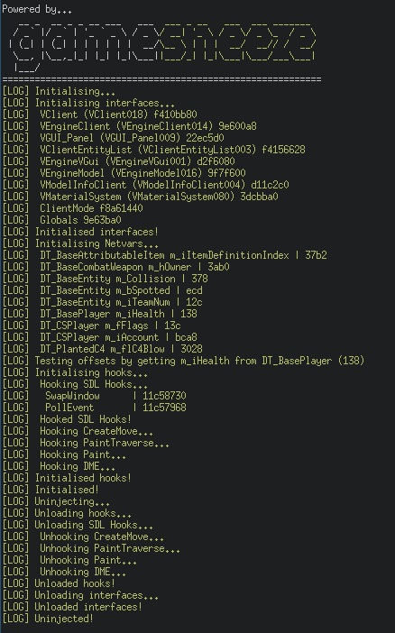
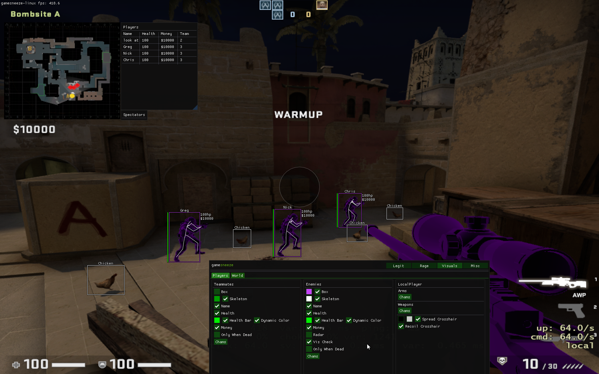

<p align="center">
  
  <a href="/LICENSE"></a>
  <a></a>
  <a></a>
  <a></a>
  <a></a>
  <a href="https://gitter.im/gamesneeze/community?utm_source=share-link&utm_medium=link&utm_campaign=share-link"></a>
  <a href="https://discord.gg/SCHsWHFJMb"></a>
</p>

An open source cheat for Counter-Strike: Global Offensive on Linux.

## :warning: :warning: THIS IS A CHEAT FOR LINUX, IT WILL NOT INJECT IF YOU ARE ON WINDOWS, AND I'M NOT PLANNING ON PORTING ANYTIME SOON, DO NOT JOIN THE DISCORD ASKING FOR DLL :warning: :warning:


## Current Features

### Interfaces

 - Interfaces::client
 - Interfaces::engine
 - Interfaces::panel
 - Interfaces::clientMode
 - Interfaces::globals
 - Interfaces::entityList
 - Interfaces::engineVgui
 - Interfaces::modelRender
 - Interfaces::modelInfo
 - Interfaces::materialSystem


### Hooks

 - CreateMove
 - PaintTraverse
 - SwapWindow
 - PollEvent
 - DrawModelExecute
 - FrameStageNotify
 - Paint


### Features

 - Chams
 - ESP
 - Weapon ESP
 - Chicken/Fish ESP
 - World colour modulation
 - Force square radar
 - Recoil crosshair
 - Rank revealer
 - Radio fake ban/fake chat
 - Clantag (and pBeeMovie clantag)
 - Backtracking
 - Backtrack Chams
 - Flappy Bird clone
 - Legitbot
 - Hitmarkers
 - Nightmode
 - Skybox changer
 - Ragebot (currently in development and doesnt have awall so no mindmg/hitchance/autoshoot)
 - AntiAim (currently sways, need to fix lby breaker)


### Others

 - Basic GDB injector
 - ImGui menu


## How to use

### Debian / Ubuntu / Pop OS / Linux Mint required packages:

`sudo apt install -y libsdl2-dev gcc-10 g++-10 gdb`

### Arch / Manjaro required packages:

`sudo pacman -S base-devel git cmake gdb sdl2 git`

### Fedora required packages:

`sudo dnf install gcc gdb sdl2-devel cmake git`


```sh
git clone https://github.com/seksea/gamesneeze
cd gamesneeze
chmod +x toolbox.sh
sudo ./toolbox.sh -u -b -l # unload cheat if currently injected, build and then load, use -h for help
```


## Basic toolbox.sh usage

| Argument          | Description                           |
| ----------------- | ------------------------------------- |
| -u (--unload)     | Unload the cheat from CS:GO if loaded |
| -l (--load)       | Load/inject the cheat via gdb         |
| -b (--build)      | Build to the build/ dir               |
| -h (--help)       | Show help                             |

All args are executed in the order they are written in, for example, "-u -b -l" would unload the cheat, build it, and then load it back into csgo.


## Found a bug or want to contribute to the project?

 - [Create a pull request](https://github.com/seksea/gamesneeze/compare) ([tutorial](https://github.com/yangsu/pull-request-tutorial))
 - [Report a bug](https://github.com/seksea/gamesneeze/issues/new)

## [Todo](https://github.com/seksea/gamesneeze/projects/1)

## Common Issues
##### GDB Segfaults and crashes game in process
Currently on Arch based distros GDB is broken, use [cathook's gdb](https://nullworks.gitlab.io/cathook/cathook/gdb) instead.

## Screenshots



